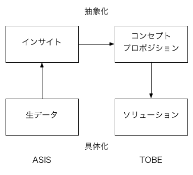

デザイナが普段からやっている方法を形式知化して、デザイナ以外でも「デザイン」できるようにしたもの。大学や企業によってプロセスに違いがあるが、「インプット→プロセス→アウトプット」の流れがあるのはだいたい同じ。

それに加えて、ユーザーの観察やインタビュー、プロトタイピングなどによって、常にフィードバックを効かせながら進んでいくので、単なる直線的ではないところも特徴。フィードバックがあるという意味で、アジャイル開発やリーンスタートアップの手法もあわせて学ぶと効率的だと思われる。

あくまでも暗黙知を形式知化したものなので（教育用に作られたものは特にそうだが）バッサリ抜けているところがありそう。インタビューや観察は誰でもできるから／できそうだから、教育メニューに入りやすい一方、後半は何らかの形でアウトプットしなきゃいけないので（アウトプットすることで新たに学ぶわけなので）、「デザイナ以外でもできる」と言いながら、まるっきり手を動かせない人はダメだと思われる。そして、ここは教育メニューに入れにくいかも。手を動かす教育は別途必要。

デザイン思考の5ステップよりも、ダブルダイヤモンドのほうがよいと思う。

* 共感から「ニーズ」と「インサイト」を探る。インサイトは相手が気づいていないもの（ニーズは○○だけど、本当は……）。
* 「インサイト」から「How might we...?」でプロダクトの「コンセプト」を作る。（「We wonder if ...」の場合もある）
* 「コンセプト」から複数の「ソリューション」を考え出す。（これが「How might we...?」の場合もある）
  * これだと「コンセプト」の抽象レベルがぐらぐらする……ので、「ソリューション」を評価してから「コンセプト」を再定義する。コンセプトは階層化してもよいかもしれない。目的手段分析図を使うとか（慶応SDMでは「バリューラダー」という名前がついてる）。

インサイトのところにジャンプがある。コンセプトメイキングのところでまたジャンプがある。単なるブレインストーミングでは、うまく飛び越えられない気がするんだけど、「コラボレーション」で片付けられている感じがする。もっとうまくやる方法が必要。

プロセスのそれぞれのステップにツールがあったほうがよさげ。

### 1. 共感（データ収集）
* 参与観察、エスノ
* インタビュー
* What? How? Why?

### 2. 問題定義（新しい着眼点からのデータの解釈）
* 図解してパターン化
* 共感マップ
* CJM or サービスブループリント
* Point Of View: [USER] needs to [USER'S NEED] because [SURPRISING INSIGHT]
* 強制的なリフレーミングのための何かが必要そう

### 3. 創造（ソリューションの決定）
* HMW?
* ブレスト
* プロトタイピング
* WHY-HOW Laddering
* エレベーターピッチ
* 魔法の杖
* メタファ

### 4. プロトタイプ（創造とセットのほうがよさげ）
* ペルソナ
* シナリオ

### 5. テスト

参考：

* http://designthinking.or.jp/bootleg.pdf
* http://www.itoki.jp/catalog/special/designthinking/pdf/designthinking.pdf

## リンク

* [d.school](http://dschool.stanford.edu/)
* [一般社団法人デザイン思考研究所](http://designthinking.or.jp/)
* [デザイン思考家になるための90分集中講座 -スタンフォード大学 d.school教室-](http://designthinking.or.jp/index.php?video)
* [デザイン思考ファシリテーションガイドブック](http://www.itoki.jp/catalog/special/designthinking/)
* [「イノベーション対話ツールの開発」について：文部科学省](http://www.mext.go.jp/a_menu/shinkou/sangaku/1347910.htm)

## スライド

<iframe src="//www.slideshare.net/slideshow/embed_code/key/KqPfYWwW8eQVob" width="425" height="355" frameborder="0" marginwidth="0" marginheight="0" scrolling="no" style="border:1px solid #CCC; border-width:1px; margin-bottom:5px; max-width: 100%;" allowfullscreen> </iframe> 
 <strong> <a href="//www.slideshare.net/kdmsnr/design-thinking-2015" title="Design Thinking 2015" target="_blank">Design Thinking 2015</a> </strong> from <strong><a href="//www.slideshare.net/kdmsnr" target="_blank">Masanori Kado</a></strong> 

## 参考文献

[参考文献](/bib/design-thinking/)
