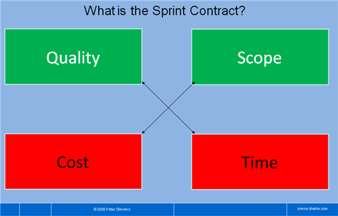
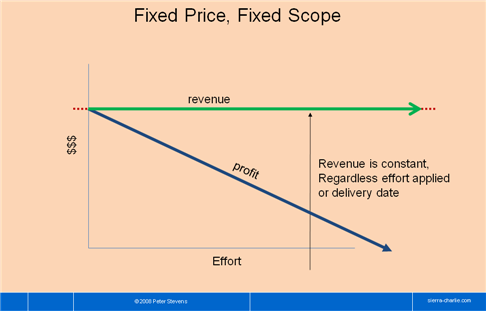
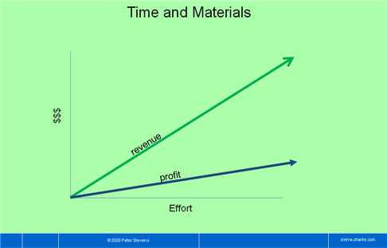
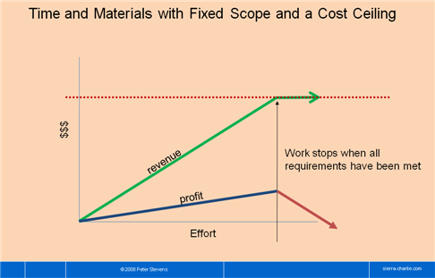
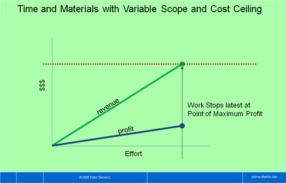
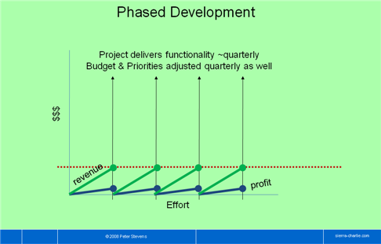
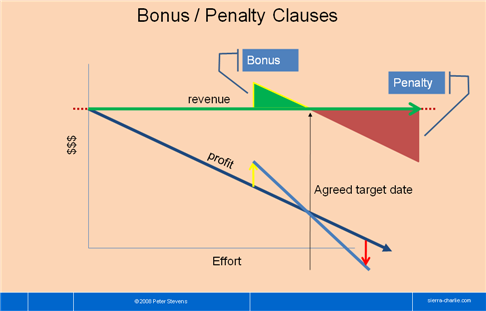
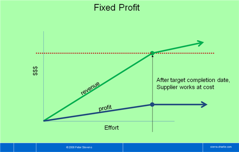
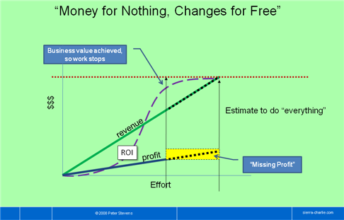

2009/4/29 by [peterstev](http://agilesoftwaredevelopment.com/user/peterstev)

以下の文章は、[Peter Stevens](http://www.scrum-breakfast.com/)による「[10 Contracts for your next Agile Software Project](http://agilesoftwaredevelopment.com/blog/peterstev/10-agile-contracts)」の日本語訳である。
[Creative Commons ― 表示-非営利 3.0 Unported](http://creativecommons.org/licenses/by-nc/3.0/deed.ja)の条件下で、ここに掲載する。

<!-- As a customer or supplier of software services at the beginning of a Software Development Project, you know that there is too much at stake to work with just a verbal agreement. A contract is really just a set of written playing rules. The right rules increase the chance of success for both parties. The wrong rules make cooperation difficult and hinder progress. What are the available playing rules and what is the best approach for a agile project? -->

ソフトウェア開発プロジェクトの最初の頃というのは、顧客であれサプライヤ
であれ、口約束だけでいろんな仕事をやらなくちゃいけない。契約書とは、言っ
てしまえば、競技のルールがだらだらと書かれてあるものにすぎない。ルール
が正しければ、顧客にとってもサプライヤにとっても、成功する確率が高まる。
ルールが間違っていれば、お互いに協力することも難しいし、進捗だって妨げ
てしまう。それでは、アジャイルプロジェクトに使える競技ルールにはどんな
ものがあるのだろうか？そして、最も適したルールとは何なのだろうか？

<!-- Last week, we looked at the purpose and contents of a contract and identified criteria for evaluating contracts for Scrum and agile projects. I suggested 4 points for comparing contract forms: -->

先週のことだが、我々は[契約書の目的や内容](http://agilesoftwaredevelopment.com/blog/peterstev/contracting-agile-software-projects)を吟味し、
[スクラムやアジャイルプロジェクトに適した契約書の評価基準](http://agilesoftwaredevelopment.com/blog/peterstev/contracting-agile-software-projects)を定めた。
そこで私は、契約の形態を比較するための4つのポイントを提示した。

<!--
* How is the contract structured?
* How does it handle changes in scope (requirements)?
* How does it apportion Risk and Reward between customer and supplier?
* What model of customer relationship does it foster: competitive (my win is your loss), cooperative (win-win), indifferent (I don’t care-you lose) or dependent (heads-I-win-tails-you lose)?
-->

構造
: 契約の構造
スコープの変更
: スコープ（要件）の変更方法
リスク
: 顧客とサプライヤ間でのリスクや報酬の配分方法
関係
: 奨励する顧客関係：競合関係（win-lose）、協力関係（win-win）、無関心（お互いのloseは気にしない）、従属関係（俺の物は俺の物、お前の物も俺の物）

<!-- This week, let’s look at a number of possible contracts, and see how they work with agile and Scrum development projects:-->

今週、見込みのありそうな契約書を取りそろえ、スクラムやアジャイルプロジェクトに適しているかどうかを調べてみた。

<!--
1. the "Sprint Contract"
2. Fixed Price / Fixed Scope
3. Time and Materials
4. Time and Materials with Fixed Scope and a Cost Ceiling
5. Time and Materials with Variable Scope and Cost Ceiling
6. Phased Development
7. Bonus / Penalty Clauses
8. Fixed Profit
9. “Money for Nothing, Changes for Free”
10. Joint Ventures
-->

1.  「スプリント契約」
2.  固定価格・固定スコープ
3.  タイムアンドマテリアル
4.  タイムアンドマテリアル（固定スコープ、上限コスト付き）
5.  タイムアンドマテリアル（変動スコープ、上限コスト付き）
6.  フェーズ開発
7.  ボーナス／ペナルティ条項
8.  固定利益
9.  「早期中止、変更無料」
10.  ジョイントベンチャー

<!-- Sprint Contract -->

##「スプリント契約」

* 「品質」と「スケジュール」は相反する
* 「スコープ」と「コスト」は相反する

<!-- Working with Scrum, I have found the metaphor of a “Sprint Contract” to be helpful in understanding (and sometimes enforcing!) the relationship between product owner and implementation team. -->

「スプリント契約」というメタファを使えば、スクラムで仕事をしているときのプロダクトオーナーと開発チームとの関係が理解しやすい（時には理解が強化される！）。

<!-- Structure: This is not really a commercial contract, but simply the agreement between the Product Owner and the Team for one sprint. -->

構造
: これは正式な契約書ではないが、スプリントにおけるプロダクトオーナーとチームとの合意がわかりやすく示されている。

<!-- Scope: The implementation team agrees to do its best to deliver an agreed on set of features (scope) to a defined quality standard by the end of the sprint. (Ideally they deliver what they promised, or even a bit more.) The Product Owner agrees not to change his instructions before the end of the Sprint. -->

スコープの変更
: 開発チームは、事前に約束した機能（スコープ）を、一定の品質基準で、スプリントの終了までに納品することに合意する（理想としては、事前に約束した以上の機能を納品する）。プロダクトオーナーは、スプリントの途中で指示を変更しないことに合意する。

<!-- Risk: a Scrum project can be considered is a series of mini projects with fixed parameters: Time (Sprint Length), Scope (Sprint Backlog), Quality (Definition of Done) and Cost (Team Size*Sprint Length). Only the scope can vary and this is measured every sprint. -->

リスク
: スクラムプロジェクトは、以下の4つのパラメータが固定されたミニプロジェクトの連続と考えることができる。時間（スプリントの長さ）、スコープ（スプリントバックログ）、品質（Doneの定義）、コスト（チームの規模×スプリントの長さ）。ただし、スコープだけは変更可能で、スプリントの終了時に計測する。

<!-- Tip: Confirming Sprint Contract in via E-Mail or posting it on the project Wiki at the beginning of every Sprint is usually good idea. It builds trust, regardless of the underlying contractual form. -->

ヒント
> 「スプリント契約」については、スプリントの開始時にEメールやプロジェクトWikiなどで確認するといいだろう。正式な契約形態とは関係なく、信頼関係を築くことができる。

<!-- Tip: The Sprint contract can be referenced in the commercial contract. I have found that after a couple of releases, the commercial contract can wither down to a one page time & materials agreement, maybe with a cost ceiling for the quarter or next major release. -->

ヒント
> 「スプリント契約」を正式な契約に反映することもできる。以前、数回のリリース後に、1ページのタイムアンドマテリアル契約に収まったことがある（次回の四半期リリースまたはメジャーリリースに向けた上限コスト付きタイムアンドマテリアル契約になることもある）。

<!-- Fixed Price / Fixed Scope -->

## 固定価格・固定スコープ

* 収益は工数や納期に関係なく一定である

<!-- Structure: Agree on the deliverables, deliver it. Send a bill. Customers like fixed price projects because it gives them security (or at least they think so). -->

構造
: 納品可能なものに合意して、それを納品する。そして、請求書を送付する。顧客は固定価格プロジェクトを好む。安心感があるからだ（少なくとも顧客はそう考えている）。

<!-- Scope changes: The name says it all, doesn't it? The change request game (correction: change request process) is intended to limit scope changes. This process is costly, and the changes are usually not preventable. Since the customer almost by definition wants more scope, ending the project can be difficult. The supplier wants the customer to be happy, so the supplier usually yields. The words ‘et cetera’ are very dangerous in the specification of a fixed price requirement. -->

スコープの変更
: 「固定スコープ」という名が示すように、この変更要求ゲーム（訂正：変更要求プロセス）では、スコープの変更が制限されている。このプロセスはコストがかかる。また、スコープの変更は避けられないことがほとんどである。顧客がスコープの追加を要求するのは当然であり、それによってプロジェクトの終了が難しくなることが多い。この場合、顧客満足を達成したいがために、サプライヤが譲歩するのが常である。固定価格の要件では、仕様書に「等」などという言葉を使うのは非常に危険である。

<!-- Risk: Obvious risk is on the side of the supplier. If the estimates are wrong, the project will lose money. Less obvious risks are the change request game, through which the supplier negotiates additional revenue through scope changes. If the supplier had badly underestimated the effort or risk, or quoted an unrealistically low price, the losses can even threaten the existence of the supplier, which also presents a problem to the customer. -->

リスク
: 明らかなリスクは、サプライヤ側にある。見積りが間違っていると、そのプロジェクトは赤字になるからだ。明らかではないリスクは、変更要求ゲームにある。変更要求ゲームでは、サプライヤはスコープの変更に対する追加収益について交渉する。工数やリスクを極端に少なく見積もっていたり、あり得ないほどの低価格を提示していたりすると、その損失はサプライヤの存続すら脅かしかねない。これもまた顧客にとっての問題となる。

<!-- Relationship: Competitive to indifferent. Customer generally wants to have more and the supplier wants to do less. The supplier wants the customer to be happy, so usually the supplier yields. -->

関係
: 競合関係～無関心。顧客は通常、より多くのスコープを求め、サプライヤはスコープをできるだけ少なくしたい。顧客満足を達成したいがために、サプライヤが譲歩することが多い。

<!-- Tip: Specify the functional requirement with user stories. I’ll discuss strategies for hitting the target on a fixed price project in a future article. -->

ヒント
> ユーザーストーリーを使って機能要件を定める。固定価格プロジェクトに対する戦略については、後ほど説明する。

<!-- Time and Materials -->
## タイムアンドマテリアル

<!-- Structure: Work for a month, then send the customer an invoice. Suppliers like it, because the customer carries the risk of changing his mind. -->

構造
: 1か月作業した分を顧客に請求する。サプライヤはこのやり方を好む。顧客の考えが変わるリスクを顧客が負うからだ。

<!-- Scope: Not a priori fixed. Sooner or later, the customer doesn't want to pay any more, so the project comes to an end. -->

スコープの変更
: 事前に固定されていない。遅かれ早かれ、顧客は支払いを拒むようになるだろう。そして、プロジェクトは終焉を迎える。

<!-- Risks: carried 100% by the client. Supplier has little incentive to keep costs down. Effort to ensure that only legitimate effort and expenses are invoiced can be substantial. -->

リスク
: すべて顧客持ち。サプライヤにはコストダウンに対するインセンティブがほとんどない。適切な工数と費用の請求を保証することが重要である。

<!-- Relationship: Indifferent. The supplier is happy when more work comes because more work means more money. -->

関係
: 無関心。サプライヤは作業が増えると嬉しい。作業が増えるともらえるお金も増えるからである。

<!-- Tip: recommended for projects where the customer can better manage the risk than the supplier. This is often combined with a cost ceiling. How well it works can depend on how the scope is handled. -->

ヒント
> 顧客がサプライヤよりもリスク管理に長けているプロジェクトであればオススメ。上限コスト付きと組み合わせることが多い。どれだけうまくいくかは、スコープをどれだけうまく管理できるか次第である。

<!-- Time and Materials with Fixed Scope and a Cost Ceiling -->
## タイムアンドマテリアル（固定スコープ、上限コスト付き）

* すべての要件が満たされたら作業ストップ

<!-- Structure: Same as fixed price, fixed scope, except if the vendor gets finished early, the project costs less, because only actual effort is invoiced. -->

構造
: 固定価格・固定スコープと同じ。ベンダーが早期に完了したら、プロジェクトのコストは低下する。実作業に対して請求するからである。

<!-- Scope: Same as fixed price, fixed scope. -->

スコープの変更
: 固定価格・固定スコープと同じ。

<!-- Risks: This appears to represent the ‘best of both worlds’ from the customer’s point of view. If it requires less effort than expected, it costs less. But the once the cost ceiling has been achieved, it behaves like a fixed price project. -->

リスク
: 顧客からすると「両者にとってベスト」と思われる。予想よりも工数が少なければ、それだけコストが少なくて済むからだ。しかし、上限コストに達すれば、固定価格プロジェクトと同じである。

<!-- Relationship: Dependent. From the supplier’s point of view, the goal is to hit the cost ceiling exactly. There is no incentive for the supplier to deliver below the maximum budgeted cost. The customer has probably treated the project internally as a fixed price project, and so has no incentive little renounce scope to save money. -->

関係
: 従属関係。サプライヤからすると、ゴールは上限コストに達することである。サプライヤには当初の予算よりも少なくするインセンティブはない。顧客は、内部的には固定価格プロジェクトとして扱っているだろうから、コストを削減するためにスコープを削ることはない。

<!-- Time and Materials with Variable Scope and Cost Ceiling -->
## タイムアンドマテリアル（変動スコープ、上限コスト付き）

* 利益が最大化する最遅点で作業ストップ

<!-- Structure: Same as time and materials except a cost ceiling limits the financial risk of the customer. -->

構造
: タイムアンドマテリアルと同じだが、上限コストがあるため、顧客にとっては経済的リスクが軽減される。

<!-- Scope: Same as a fixed price, fixed scope project. -->

スコープの変更
: 固定価格・固定スコープと同じ。

<!-- Risks: the budget will expire without achieving the necessary business value for the customer. Customer won’t get everything he asks for. -->

リスク
: 顧客にとって必要なビジネス価値が達成できないまま予算切れになることがある。顧客は求めたものすべてを手に入れられるわけではない。

<!-- Relationship: Cooperative. The combination of limited budget and variable scope focuses both customer and vendor on achieving the desired business value within the available budge. -->

関係
: 協力関係。限られた予算と変動スコープを組み合わせることで、顧客とベンダーは、求められるビジネス価値を利用できる予算内で達成しようとする。

<!-- Tip: From experience, I would say this contract form mixes well with Scrum. The customer has control over each individual sprint. A constructive relationship means that even if problems develop on the way, the emotions are right to come to a mutually agreeable solution. -->

ヒント
> 私の経験から言わせてもらえば、この契約形態はスクラムとよく馴染む。スプリントをコントロールするのは顧客である。協力関係とは、途中で何か問題が発生しても、お互いが納得できる解決策にたどり着けるということだ。

<!-- Phased Development -->
## フェーズ開発

* 四半期以内に機能を納品する。予算と優先度も四半期ごとに調整する。

<!-- Structure: Fund quarterly releases and approve additional funds after each successful release. -->

構造
: 四半期のリリースごとに予算を作り、リリースが成功すれば、追加予算を認める。

<!-- Scope Changes: Not explicitly defined by the model. Releases are in effect time boxed. The knowledge that there will be another release next quarter makes it easier to accept postponing a feature to achieve the time box. -->

スコープの変更
: このモデルでは明確に定義されていない。ここで言うリリースとは、いわばタイムボックスである。四半期後に次のリリースが用意されているので、タイムボックスに入らない機能をあと回しにすることが容易に受け入れられる。

<!-- Risk: Customer’s risk is limited to one quarter’s worth of development costs. -->

リスク
: 顧客のリスクは四半期ごとの開発コストに制限される。

<!-- Relationship: Cooperative. Both the customer and the supplier have an incentive that each release be successful, so that additional funding will be approved. -->

関係
: 協力関係。顧客とサプライヤのどちらにも各リリースが成功することに対してインセンティブがある。リリースが成功すれば、追加予算が認められる。

<!-- Tips: Venture capitalists often work on this basis. This mixes well with Time and Materials with Variable Scope and a Cost Ceiling. I have worked quite happily under this model. We simply specified the Release goal, hourly rate and cost ceiling in the commercial contract. The customer provided the product owner. Everything else was determined in the sprint contracts. -->

ヒント
> ベンチャーキャピタリストはこのやり方をしている。これは、タイムアンドマテリアル（変動スコープ、上限コスト付き）とうまく組み合わせることができる。私はこのモデルを適用して幸せに働いたことがある。両者でリリース目標、時間給、上限コストを簡単に決めてから、顧客がプロダクトオーナーを選出した。その他のことは、「スプリント契約」で決めた。

<!-- Bonus / Penalty Clauses -->
## ボーナス／ペナルティ条項

<!-- Structure: Supplier receives a bonus if the project completes early and pays a penalty if it arrives late. The amount of bonus or penalty is a function of the delay -->

構造
: サプライヤは、プロジェクトが早期に完了したらボーナスを受け取り、遅延したらペナルティを支払う。ボーナスとペナルティの金額は、遅延した機能分である。

<!-- Scope Changes: difficult to accept because changes potentially impact the delivery date, which is surely not allowed. -->

スコープの変更
: 受け入れることは難しい。変更は遅延につながりかねない。遅延は絶対に許されない。

<!-- Risk: Does the customer have an incentive for early completion? The ROI arguments must be compelling and transparent. Otherwise the customer gets a cheaper solution the longer it takes. -->

リスク
: 顧客には早期完了に対するインセンティブはあるだろうか？ROIを論拠にすれば、説得力があり、誰の目にも明らかである。さもなければ、顧客は安価だが時間のかかるソリューションを手に入れることになる。

<!-- Relationship: could be cooperative, but might degenerate into indifferent if the customer does not truly need the software by the date agreed. -->

関係
: 協力関係にもなりうるが、顧客が合意した日までに本当にそのソフトウェアが欲しいということでなければ、無関心へと悪化する。

<!-- Tip: Often applied for construction projects, e.g. roads, tunnels and runways, for which it works well. Scope changes are not issue and genuine economic costs drive the customer to achieve the deadline as well. -->

ヒント
> 建設工事（道、トンネル、滑走路）に適しているため、よく利用される。スコープの変更は重要ではなく、純粋な経済コストによって顧客は期日を守ろうとする。

<!-- Fixed Profit -->
## 固定利益

* 目標完了日を過ぎると、サプライヤは原価で作業する。

<!-- Structure: any project budget consists of effective costs and profit. The parties agree on the profit in advance, e.g. $100,000. Regardless of when the project is completed, the contractor receives the incurred costs plus the agreed profit. -->

構造
: あらゆるプロジェクト予算は、費用と利益によって成立している。たとえば、両者が事前に10万ドルの利益に合意したとする。いつプロジェクトが完了しても、請負人はかかった費用プラス合意した利益を受け取ることができる。

<!-- Scope is fixed- -->

スコープの変更
: 固定。

<!-- Risk is shared. If project finishes early, the customer pays less, but the supplier still has his profit. If the project exceeds budget, the customer pays more, but the supplier does not earn additional profit. After the target delivery date, the supplier may not invoice any more profit, just cover his costs. -->

リスク
: は共有。プロジェクトが早期に完了したら、顧客の支払いは少なくて済む。しかし、サプライヤも利益を受け取れる。プロジェクトが予算を超過したら、顧客の支払いは多くなるが、サプライヤは追加の利益を得ることはできない。期日を過ぎると、サプライヤは追加の利益を請求できなくなるが、費用はカバーできる。

<!-- Relationship: Cooperative - both have a clear incentive to finish early. The customer saves money and the supplier has a higher profit margin. -->

関係
: 協力関係。両者とも早期完了へのインセンティブが明確。顧客はコストを削減できる。サプライヤは利ざやが大きくなる。

<!-- “Money for Nothing, Changes for Free” -->
## 早期中止、変更無料

<!-- Structure: This works with agile software projects because there is little or no work in progress. After each sprint, functionality is either complete or not started. Work is basically on a Time and Materials basis with a cost target, often with the intention that the project should not use up the entire project budget. After a certain amount of functionality has been delivered, the customer should realize that enough business value has been realized that further development is not necessary and can therefore cancel the project. A cancellation fee equal to the remaining profit is due. -->

構造
: 仕掛品がほどんどなくなるため、アジャイルソフトウェアプロジェクトとよく馴染む。スプリント終了後には、機能は「完成している」か「着手されていないか」のいずれかである。作業は基本的にはタイムアンドマテリアル（上限コスト付き）で行うが、プロジェクト予算を使い果たしてはいけないという暗黙の了解がある。一定の機能が納品されると、顧客は十分なビジネス価値があると見なして、これ以上の開発は必要ないと判断し、プロジェクトを中止する。キャンセル料は、支払われるべき利益と同額。

<!-- Scope: can be changed. Planned but unimplemented features can be replaced with other stories of the same size. Additional features cost extra. -->

スコープの変更
: 変更できる。計画されていたが実装されていない機能は、同サイズのストーリーと入れ替えることができる。機能を追加するには追加費用がかかる。

<!-- Risk: Shared. Both parties have an interest in completing the project early. Customer has lower costs, supplier has a higher margin. -->

リスク
: 共有。両者ともプロジェクトを早期に完了したい。顧客はコスト削減、サプライヤは大きな利ざや。

<!-- Tip: If the budget is exceeded, the rules of the fixed profit or cost ceiling contracts can be applied. The fixed profit approach is more consistent with the goal of a fostering a cooperative relationship. -->

ヒント
> 予算が超過したら、固定利益や上限コストのルールを適用できる。固定利益のほうが協力関係を育てることができる。

<!-- Joint Ventures -->
## ジョイントベンチャー

 

Photo courtesy of [hydropeek@flickr](http://www.flickr.com/photos/hydropeek/)

<!-- Structure: Two partners invest in a product of joint interest. Money is unlikely to flow directly between the partners in the development phase, but each party must have an ROI, which may come from revenue sharing or just benefits from using the software. -->

構造
: 両者が協同出資の形でプロダクトに出資する。開発フェーズでお金が飛び交うなんてことはないが、レベニューシェアやソフトウェアを利用することで得られる利益が基にしてROIを測ることになる。

<!-- Scope: Defined to suit the needs of the partnership. -->

スコープの変更
: 両者の必要なものに合わせて定義する。

<!-- Risks: Two of everything. Decision chains can get long. Rivalries can develop between the teams. Different models for extracting value from the product can lead to different priorities differing willingness to invest. -->

リスク
: なんでも半分ずつ。意志決定時間は長くなりがち。両者間にライバル心が芽生えるかも。プロダクトから価値を抜き出すモデルが違えば、優先度も違ってきて、出資の意欲も違ったものになってしまう。

<!-- Tips: Treat the project as a separate company: One team, co-located, with development and product marketing/product owner role. Think realistically about friendly and not so friendly separation scenarios. -->

ヒント
> プロジェクトを独立した企業だと考えてみる。1チームに開発・プロダクトマーケティング・プロダクトオーナーの役割を入れる。現実的には、親しい者とそうでない者とを分けてもよい。

<!-- Recommendations -->
## おすすめ

<!-- I have worked quite happily for years with a phased development contract. The original contract was a fixed scope contract with a cost ceiling, but as we worked together and built up the level of trust, the surrounding text just withered away. Trust, a bit of boilerplate, the sprint contract and a quarterly sign-off from top management worked quite nicely. -->

私はフェーズ開発契約で長年やってこれたのだが、これは非常に幸せなことだと思う。最初は固定スコープ（上限コスト付き）契約だったが、一緒に働いて、信頼のレベルを上げることで、契約書から余計な文言が消えていった。信頼、ほんのちょっとの決まり文句、スプリント契約、四半期ごとの経営陣の承認、これでうまくいった。

<!-- “Money for nothing, changes for free” contract turns the advantages of the Scrum and agile development processes into a competitive advantage. -->

「早期中止、変更無料」契約は、スクラムやアジャイル開発プロセスの強みを競争力の高い強みへと変えてくれる。

<!--
* By prioritizing and delivering business value incrementally, the chances of an outright failure are dramatically reduced. This advantage is passed on to the customer.
* Furthermore, it’s a cooperative model, so it offers incentives to both parties to keep the costs down.
* The early cancellation clause rewards the higher productivity achieved with Scrum teams. On the down side, this clause feels a bit like a 'golden parachute' which may not be politically acceptable in the current economic climate.
-->

* 漸進的にビジネス価値を優先付けて納品していくことで、完全な失敗というのは劇的に減っていく。この強みは、顧客に還元される。
* さらに、協力モデルによって、コストダウンに対する両者のインセンティブが高まる。
* 早期中止条項によって、スクラムチームが成し遂げる高い生産性に報いることができる。マイナス面では、この条項が「ゴールデンパラシュート（高額の退職金）」のように受け止められてしまうことだ。今日のような経済危機の状況下では、政治的に受け入れにくいことかもしれない。

<!-- This contract might be work with a cost ceiling although I would be wary of losing the cooperative relationship. -->

この契約は、上限コストと合わせるとうまくいくかもしれない。
ただし、協力関係が崩れてしまうかもしれないことは警告しておこう。

<!-- The contract form lays the important groundwork for a successful project. And the Agile Manifesto got right: working with the customer is more important than the contract. So whatever you do, keep the customer relationship positive!-->

契約形態は、成功プロジェクトの基礎を築くものだ。アジャイルマニフェストは正しかった。契約よりも顧客との協働が重要なのである。何をするにしても、顧客との関係は良好に！

<!-- Further reading -->
## さらに詳しく知るために

<!--
* Fixed price projects and agile development are considered not to mix. I know from experience that this is not strictly true. I am also convinced that other forms are better.
* A fixed profit contract is also known as Cost Plus Fixed Fee - there are other several variations on Cost Plus contracts.
* Excerpt on Contracts from Lean Software Development, by Mary Poppendieck and Tom Poppendieck - a summary of many current contract forms, a discussion of trust, and a reminder that there is more to success than satisfying the 'iron triangle.'
* Jeff Sutherland's Money for Nothing posting. A draft contract is under development from the Agile Project Group initiated by Gerry Kirk.
-->

* [固定価格プロジェクトとアジャイル開発](http://agilesoftwaredevelopment.com/node/418)は馴染まないと言われている。私の経験からすると、これは厳密には正しくない。とはいえ、他の契約形態のほうが良いと思う。

* 固定利益契約は[コストプラス固定費](http://en.wikipedia.org/wiki/Cost-plus_contract)契約とも言われる。コストプラス○○契約には、他にもいくつか種類がある。

* [『リーンソフトウェア開発』（Mary Poppendieck、Tom Poppendieck著）の契約の項](http://www.poppendieck.com/pdfs/Contracts_Excerpt_from_Lean_Software_Devleopment.pdf)には、今日の契約形態のまとめ、信頼についての議論、成功するには「鉄の三角形」を満たすよりもやることはたくさんあるだという喚起が記載されている。

* Jeff Sutherlandの[早期中止](http://jeffsutherland.com/scrum/2008/08/agile-2008-money-for-nothing.html)に関する記事。[Agile Project Group](http://www.openplans.org/projects/agile-contracts)でGerry Kirkが中心となって[契約の草案](http://www.openplans.org/projects/agile-contracts/money-for-nothing-change-for-free)が作成されている。

## 日本語訳について

### Change Log

* 2012/3/21: ちょっとだけ推敲。
* 2009/5/9: 翻訳。

